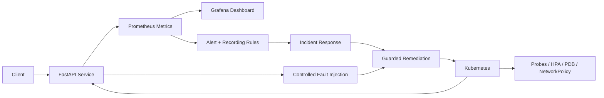

# SRE Reliability Engineering Lab

<p align="center"><strong>Measure reliability. Inject failure. Recover safely. Learn continuously.</strong></p>

<p align="center">
<a href="https://github.com/obinna-obika-devops/sre-reliability-engineering-lab/actions/workflows/ci.yml"></a>


</p>

A production-minded reliability engineering lab focused on **SLOs, observability, incident response, failure injection, guarded remediation, and Kubernetes reliability**.

## Architecture



## Reliability evidence

| Reliability area | Inspectable evidence |
|---|---|
| Instrumented service | [`app/`](app/) |
| Metrics, alerts and dashboards | [`observability/`](observability/) |
| Kubernetes reliability controls | [`kubernetes/`](kubernetes/) |
| Controlled failure testing | [`chaos/`](chaos/) |
| Guarded recovery tooling | [`remediation/`](remediation/) |
| SLO and error-budget policy | [`sre/`](sre/) |
| Incident procedures | [`runbooks/`](runbooks/) |
| Infrastructure reference patterns | [`terraform/`](terraform/) |
| CI validation | [`.github/workflows/`](.github/workflows/) |

## Reliability loop

**Observe → Detect → Mitigate → Recover → Validate → Learn → Improve**

## What this demonstrates

- Define SLIs/SLOs and reason about error budgets
- Instrument a Python service with Prometheus metrics
- Run repeatable reliability tests locally with Docker Compose
- Operate workloads with Kubernetes probes, PDBs, HPA, resource limits and NetworkPolicies
- Detect high error rate and latency with Prometheus alert and recording rules
- Practice incident response with actionable runbooks and blameless learning practices
- Inject controlled failures and verify recovery behavior
- Validate application tests, container builds, Prometheus rules, remediation dry runs and repository security in CI

## Engineering components

- `app/` — instrumented service and tests
- `observability/` — Prometheus configuration, alert/recording rules and Grafana dashboard
- `kubernetes/` — workload reliability and security controls
- `chaos/` + `remediation/` — controlled failure and guarded recovery
- `sre/` + `runbooks/` — SLO and incident-management procedures
- `.github/workflows/` — CI, security scanning and chaos-scope validation

## Technology

| Area | Stack |
|---|---|
| Service | FastAPI / Python |
| Metrics | Prometheus |
| Dashboards | Grafana |
| Platform | Kubernetes / Docker Compose |
| Reliability | SLOs / Error Budgets / PDB / HPA |
| Failure Testing | Chaos Mesh manifest patterns |
| Automation | Python remediation tooling |

## Quick start

```bash
make test
make run
```

```bash
docker compose -f deploy/docker-compose.yml up --build
```

Service endpoints: `/healthz`, `/readyz`, `/metrics`, and `/api`.

Fault injection is explicit and disabled by default. Set `FAULT_MODE=error` or `FAULT_MODE=latency` for local experiments.

## SRE model

The lab uses a 99.9% availability target and a latency objective for the sample API. Error-budget policy is documented in `sre/slo.md`. Incidents follow detection → mitigation → recovery → learning, with blameless postmortem practices.

## Repository map

```text
app/                 instrumented service and tests
observability/       Prometheus rules/configuration and Grafana dashboard
kubernetes/          production-style workload controls
chaos/               controlled failure experiments
remediation/         guarded recovery automation
sre/                 SLOs, capacity and incident management
runbooks/            operator procedures
terraform/           AWS reliability reference patterns
.github/workflows/   CI, security and chaos validation
```

> Reference implementation. It does not claim that production AWS resources or customer traffic are running unless explicitly stated.

## Engineering principles

1. Reliability is measurable.
2. Automation must be safe and observable.
3. Failure is tested before it becomes an incident.
4. Capacity is planned, not guessed.
5. Postmortems improve systems, not punish people.
