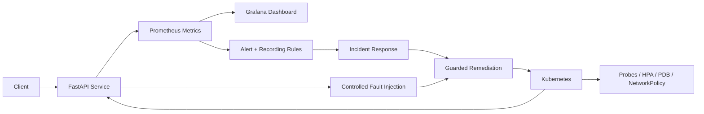

# SRE Reliability Engineering Lab

<p align="center"><strong>Reliability engineering through measurable objectives, observability, controlled failure testing and safe recovery.</strong></p>

<p align="center">
<a href="https://github.com/obinna-obika-devops/sre-reliability-engineering-lab/actions/workflows/ci.yml"></a>


</p>

A reliability engineering reference implementation built around one operating principle: **reliability should be measurable, testable and recoverable**. The system combines service-level objectives, application telemetry, Kubernetes resilience controls, controlled fault injection, incident procedures and guarded remediation into a single operational workflow.

## Engineering problem

Reliable services require more than uptime checks. Teams need a way to define acceptable reliability, detect when user experience is degrading, understand error-budget consumption, exercise failure paths before real incidents occur and recover without introducing additional risk.

This repository models that operating loop end to end:

**Define → Observe → Detect → Mitigate → Recover → Validate → Learn → Improve**

## Reliability objectives

The sample service is governed by explicit service-level objectives rather than vague availability goals:

- **Availability SLO:** 99.9% successful requests to `/api`
- **Latency SLO:** 99% of requests complete in under 500 ms
- **Error budget:** 0.1% of eligible requests
- **Burn-rate response:** sustained budget consumption can trigger mitigation, rollback or a temporary freeze on risky changes

See [`sre/slo.md`](sre/slo.md) for the full policy.

## Architecture



## Reliability evidence

| Reliability concern | Inspectable implementation |
|---|---|
| Instrumented application | [`app/`](app/) |
| SLO and error-budget policy | [`sre/slo.md`](sre/slo.md) |
| Metrics, alerts and dashboards | [`observability/`](observability/) |
| Kubernetes resilience | [`kubernetes/`](kubernetes/) |
| Controlled failure testing | [`chaos/`](chaos/) |
| Guarded recovery automation | [`remediation/`](remediation/) |
| Incident procedures | [`runbooks/`](runbooks/) |
| Infrastructure reference patterns | [`terraform/`](terraform/) |
| Automated validation | [`.github/workflows/`](.github/workflows/) |

## What was engineered

### Service observability

The FastAPI workload exposes health, readiness and Prometheus metrics so reliability decisions can be based on service behavior rather than infrastructure state alone.

### Kubernetes resilience

Workload definitions demonstrate production-style controls including readiness/liveness behavior, resource limits, Horizontal Pod Autoscaling, Pod Disruption Budgets and network-policy boundaries.

### SLO-driven operations

Availability and latency objectives establish a measurable reliability contract. Error-budget policy connects service health to delivery decisions so release velocity can change when reliability deteriorates.

### Failure testing

Controlled fault scenarios exercise error and latency paths deliberately. Failure injection is opt-in and disabled by default, keeping experiments explicit and bounded.

### Incident response

Prometheus alerting and runbooks connect detection to operator action. The incident model follows detection → mitigation → recovery → validation → learning rather than treating alerts as the end of the workflow.

### Guarded remediation

Recovery automation is designed around safe execution and dry-run validation instead of unconditional self-healing. The goal is to automate repeatable operational work while keeping remediation observable and reversible.

## Engineering decisions

| Decision | Rationale |
|---|---|
| Define SLOs before alerts | Alerts should represent user-visible reliability risk, not every technical anomaly |
| Use error budgets | Balances delivery velocity with reliability rather than optimizing uptime at any cost |
| Separate detection from remediation | Prevents an alert from automatically becoming an unsafe production change |
| Make fault injection explicit | Keeps experiments controlled and prevents accidental disruption |
| Validate recovery paths | A mitigation is incomplete until service health is confirmed |
| Keep runbooks with the system | Operational knowledge should evolve alongside code and configuration |

## Technology

| Area | Stack |
|---|---|
| Service | FastAPI / Python |
| Metrics | Prometheus |
| Dashboards | Grafana |
| Platform | Kubernetes / Docker Compose |
| Reliability | SLOs / Error Budgets / PDB / HPA |
| Failure Testing | Chaos Mesh manifest patterns |
| Automation | Python remediation tooling |
| Infrastructure | Terraform reference patterns |

## Repository map

```text
app/                 instrumented service and tests
observability/       Prometheus rules/configuration and Grafana dashboard
kubernetes/          workload reliability and security controls
chaos/               controlled failure experiments
remediation/         guarded recovery automation
sre/                 SLO, error-budget and capacity practices
runbooks/            operator and incident procedures
terraform/           AWS reliability reference patterns
deploy/              local runtime configuration
.github/workflows/   CI, security and reliability validation
```

## Local validation

```bash
make test
make run
```

Or run the local stack:

```bash
docker compose -f deploy/docker-compose.yml up --build
```

Service endpoints include `/healthz`, `/readyz`, `/metrics`, and `/api`.

For controlled local experiments:

```bash
FAULT_MODE=error
# or
FAULT_MODE=latency
```

Fault injection remains disabled unless explicitly enabled.

## Operational principles

1. Reliability is measured against user-facing objectives.
2. Alerts should lead to clear operator action.
3. Automation must be safe, observable and reversible.
4. Failure paths should be exercised before real incidents expose them.
5. Capacity and resilience are designed rather than assumed.
6. Post-incident learning should improve systems and procedures.

## Scope

This is a reference implementation for SRE and reliability-engineering practices. It demonstrates the controls, automation and operating model in code without claiming currently running production infrastructure, customer traffic or operational history that is not explicitly evidenced in the repository.
