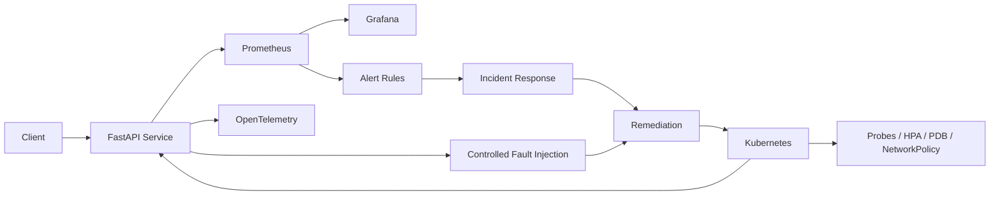

# SRE Reliability Engineering Lab

<p align="center"><strong>Measure reliability. Inject failure. Recover safely. Learn continuously.</strong></p>

<p align="center">


</p>

A production-minded reliability engineering lab focused on **SLOs, observability, incident response, failure injection, automated remediation, and Kubernetes reliability**.

## Architecture



## Reliability loop

**Observe → Detect → Mitigate → Recover → Validate → Learn → Improve**

## What this demonstrates

- Define SLIs/SLOs and calculate error budgets
- Instrument a Python service with Prometheus metrics
- Run repeatable reliability tests locally with Docker Compose
- Operate workloads with Kubernetes probes, PDBs, HPA, resource limits and NetworkPolicies
- Detect high error rate, latency and saturation with Prometheus rules
- Practice incident response with actionable runbooks and a blameless postmortem
- Inject controlled failures and verify recovery
- Scan source, containers and IaC in CI

## Technology

| Area | Stack |
|---|---|
| Service | FastAPI / Python |
| Metrics | Prometheus |
| Dashboards | Grafana |
| Telemetry | OpenTelemetry |
| Platform | Kubernetes / Docker Compose |
| Reliability | SLOs / Error Budgets / PDB / HPA |
| Failure Testing | Controlled chaos experiments |
| Automation | Python remediation tooling |

## Quick start

```bash
make test
make run
```

With Docker Compose:

```bash
docker compose -f deploy/docker-compose.yml up --build
```

Service endpoints:
- `/healthz` — liveness
- `/readyz` — readiness
- `/metrics` — Prometheus metrics
- `/api` — sample workload

Fault injection is explicit and disabled by default. Set `FAULT_MODE=error` or `FAULT_MODE=latency` for local experiments.

## SRE model

The lab uses a 99.9% availability target and a latency objective for the sample API. Error-budget policy is documented in `sre/slo.md`. Incidents are handled through detection → mitigation → recovery → learning, with no-blame postmortems.

## Repository map

```text
app/                 instrumented service and tests
observability/       Prometheus, Alertmanager and Grafana configuration
kubernetes/           production-style workload controls
chaos/                controlled failure experiments
remediation/          safe, idempotent recovery automation
sre/                  SLOs, capacity and incident management
runbooks/             operator procedures
terraform/            AWS reliability reference patterns
.github/workflows/    CI, security and chaos validation
```

> Portfolio/reference implementation. It does not claim that production AWS resources or customer traffic are running unless explicitly stated.

## Engineering principles

1. Reliability is measurable.
2. Automation must be safe and observable.
3. Failure is tested before it becomes an incident.
4. Capacity is planned, not guessed.
5. Postmortems improve systems, not punish people.
